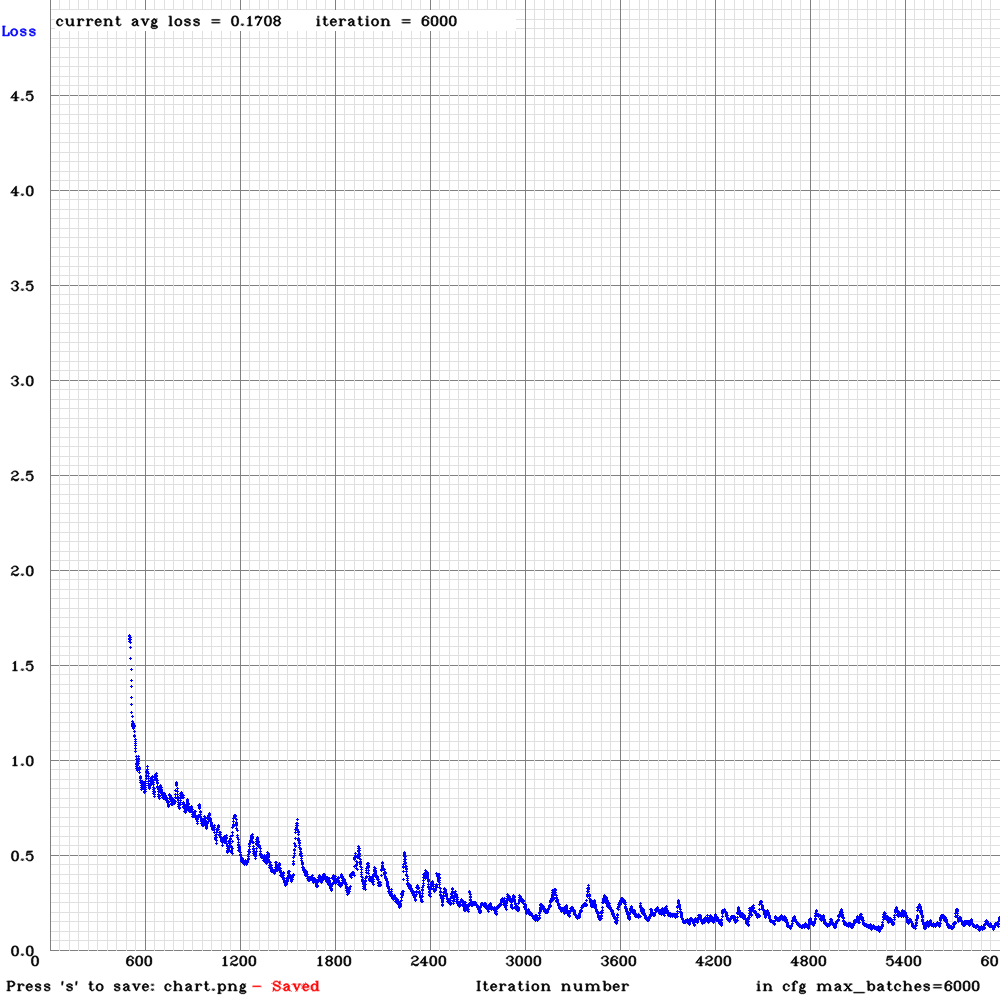
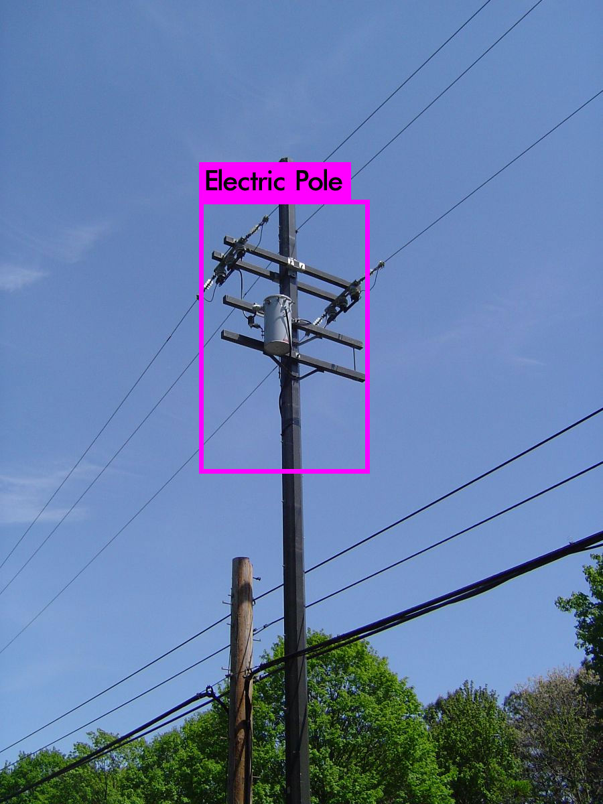

# Pole-detection-using-darknet

A system that can rocognize a pole in a image or video given and react according to it. It
uses a “convolutional neural network” achitecture to detect and classify objects on
the image. It require a set of data consisting of images of poles from various angles. 
The images are then labeled using a tool which draws a rectangle around
the image where the pole is located. These labeled images are resized and proccessed
to reduce its size before training the neural network. The neural network is trained on
these images and can succssfully detect poles on a image or video with accuracy upto
97% at 30 FPS video.

# Training Chart (graph)

# Prediction

# Terminal command for testing

for Video:

<code>./darknet detector demo cfg/trainer.data cfg/obj-yolov3-tiny.cfg obj-yolov3-tiny_6000.weights "video.mp4" 
 
for Image:

<code>./darknet detector test cfg/trainer.data cfg/obj-yolov3-tiny.cfg obj-yolov3-tiny_6000.weights "image.jpg" 
